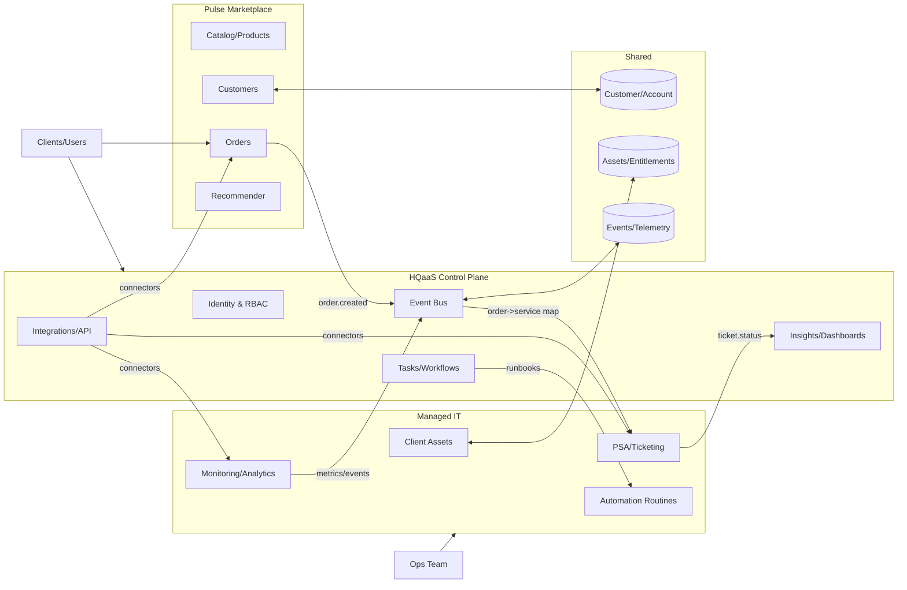

# Marcoby Systems Architecture — Draft v0

Purpose
High-level view of how Pulse, Catalyst, and Nexus interact. Focus: data flows, events, and handoffs.

Mermaid (logical view)

Key Boundaries

- Pulse owns product/catalog, orders, and commerce UX
- Catalyst owns service delivery, SLAs, and client assets
- Nexus orchestrates identity, workflows, insights, and integrations

Security & Identity

- Central RBAC in Nexus; SCIM/SSO to Pulse/Catalyst
- Auditable event bus; least-privilege connectors

Next Steps

- Define canonical event schema (order.created, entitlement.provisioned, ticket.closed)
- Choose integration layer (webhooks + queue; e.g., SNS/SQS, Kafka, or Azure Service Bus)
- Map data contracts for D1/D2/D3
- Add error handling and retry policies
